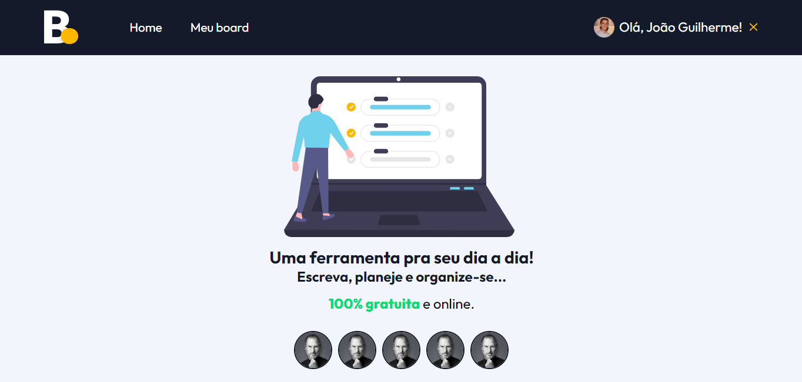

# Board App


Link da aplicação: <a target="_blank" href="https://jgsl-board.netlify.app/">https://jgsl-board.netlify.app/
</a>

### 💼 Ajustes e alterações

> O projeto foi finalizado.

- [x] Page Home 
- [x] Page Board 
- [x] Componetização 
- [x] Autenticação com NextAuth
- [x] Implementando com Firebase 
- [x] Estilização com scss
- [x] Estados e hooks
- [x] Page Board/Id
- [x] Método de Pagamento 
- [x] Diferenças entre Donater e Não-Donater

### 📁 Páginas do projeto

- **Home**: apresentação do projeto e visualização dos apoiadores.
- **Board**: lista de tarefas, onde o usuário pode adicionar, remover, excluir e visualizar as tarefas.
- **Inspect**: visualização da tarefa por meio do ID.
- **Donate**: o usuário pode apoiar o projeto, efetuando o pagamento pelo paypal.

### 👨‍💻 Tecnologias
Tecnologias usadas no projeto:

<ul>
    <li>HTML</li>
    <li>SASS</li>
    <li>TypeScript</li>
    <li>NextJS</li>
    <li>NextAuth</li>
    <li>Firebase</li>
    <li>React Toastify</li>
    <li>PayPal developer</li>
</ul>

### 💼 Como o projeto funciona

O projeto consiste em um app de tarefas com Login por meio da biblioteca NextAuth.
O usuário pode logar com a conta do GitHub. * O usuário só pode acessar a page 'Board' caso esteja logado.
Na page 'Board' ele pode adicionar, remover e visualizar tarefas. 
Todas as tarefas são salvas no banco de dados fornecido pela Google, firebase.
Quando o usuário apoia o projeto pagando R$1,00 pelo PayPal ele tem acesso a ferramentas que os não pagantes não possuem.
O usuário tem mensagens exclusivas, pode inspecionar a tarefa e também editar a tarefa.
Além de a foto do usuário aparecer nos Apoiadores, na página 'Home'.

### 🤝 Colaborador

<table>
  <tr>
    <td align="center">
      <a href="#">
        <br>
        <sub>
          <b>João Guilherme</b>
        </sub>
      </a>
    </td>
  </tr>
</table>

### :closed_book: Requisitos ##

Depois de iniciar :checkered_flag:, você precisa ter o  [Git](https://git-scm.com) e o [Node](https://nodejs.org/en/) instalados.

## :checkered_flag: Iniciar ##

```bash
# Clonar o projeto
$ git clone https://github.com/jguilhermesl/board-app
# Acesse
$ cd board-app
# Instalar dependências
$ yarn ou npm 
# Rodar o projeto
$ npm run dev ou yarn dev
# O servidor será inicializado em <http://localhost:3000>
```